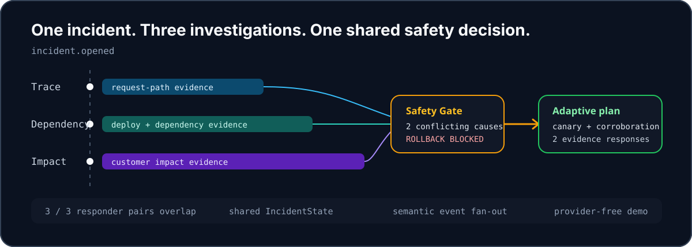
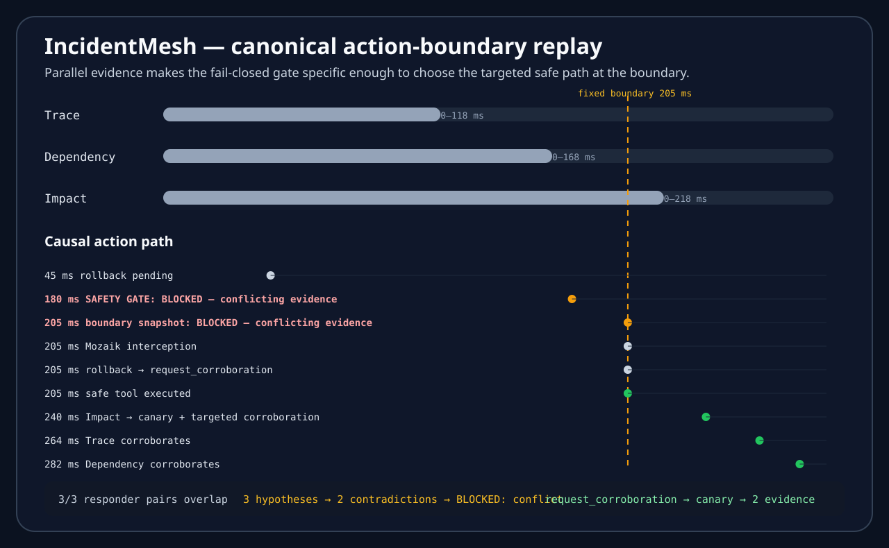

<h1>
  <picture>
    <source media="(prefers-color-scheme: dark)" srcset="docs/assets/wordmark-dark.svg" />
    
  </picture>
</h1>

### Concurrent incident response. Evidence before action.

Independent responders share evidence that can change a production-action proposal before it executes.

<picture>
  <source media="(max-width: 600px)" srcset="docs/assets/hero-narrow.svg" />
  
</picture>

[Quick start](#quick-start) · [Causal proof](#causal-concurrency-ablation) · [Replay](#demo)

## Why IncidentMesh?

Trace, Dependency, and Impact investigate concurrently and share their findings while peers are still working. The Safety Gate uses that evidence to decide what a pending rollback may safely do at the action boundary. **Parallel work changes the safe plan available at the boundary, not just the time it takes.**

The default demo uses deterministic evidence and Mozaik's real function-call loop. Action tools are proposal-only; no production infrastructure is changed.

## Quick start

Node.js 20+ · No provider key required for the default demo.

```bash
git clone https://github.com/1337isnot1337/incidentmesh.git
cd incidentmesh
npm ci
npm run demo
```

[](https://github.com/1337isnot1337/incidentmesh/actions/workflows/ci.yml)  

## Causal concurrency ablation

**Same evidence. Same policy. Different safe plan at the boundary.**

`npm run ablation` changes only evidence scheduling. The incident, three evidence items, confidence values, gate rule, proposed action, and configured 205 ms action-boundary timer stay constant.

| At the action boundary | Concurrent | Sequential |
| --- | --- | --- |
| Required hypotheses available | 3 | 1 |
| Missing required roles | none | Dependency, Impact |
| Contradictions visible | 2 | 0 |
| Boundary decision | **BLOCKED** | **BLOCKED** |
| Boundary reason | `conflicting-evidence` | `incomplete-required-evidence` |
| Mozaik intercepts rollback | Yes | Yes |
| Tool executed | `request_corroboration` | `request_corroboration` |
| Safe control path | canary + targeted corroboration | hold for missing evidence |
| Conflict-informed canary | available at the boundary | available only after remaining evidence arrives |

Both schedules eventually reach the **same three hypotheses, two contradictions, and `BLOCKED — conflicting-evidence` investigation state**. No arm authorizes production from incomplete evidence. Parallel scheduling makes the conflict visible early enough to select the targeted canary path immediately; serialized scheduling leaves required evidence missing, so the same fail-closed policy holds the rollback until the conflict becomes visible later.

`npm run ablation` also reports **time to actionable safe mitigation**: approximately the action boundary for the concurrent fixture and roughly 460–470 ms for the sequential fixture in verified runs. This is a deterministic fixture latency, **not MTTR and not a production-speedup claim**. The 205 ms boundary is a configured JavaScript timer; host scheduling may delay the callback, and `action.attemptedAtMs` records the observed time.

## Demo

The replay below is generated from a canonical run. Responder bars show measured overlap; the event ledger shows what followed the boundary decision.

[](docs/evidence/replay.svg)

[Open full-size replay](docs/evidence/replay.svg) · [Inspect source report](docs/evidence/replay.json) · [90-second demo guide](docs/demo.md)

```bash
npm run replay:visual  # generate an SVG and its source JSON from one run
```

Timing varies by machine and scheduler load. The canonical fixture produces three overlapping responder pairs, three hypotheses, two contradictions, a blocked gate, a canary replan, and two follow-up evidence responses.

## How it works

1. **Investigate together.** One `incident.opened` event wakes Trace, Dependency, and Impact. Each has independent handlers and a lifecycle.
2. **Share evidence as it arrives.** Typed hypotheses enter `IncidentState`; runtime handlers observe peer findings while investigations remain active.
3. **Separate investigation from action safety.** Evidence can remain `PENDING` while responders are still working, but rollback may cross the action boundary only on an affirmative `APPROVED`. Missing required evidence becomes `BLOCKED — incomplete-required-evidence`; complete disagreement becomes `BLOCKED — conflicting-evidence`.
4. **Intercept and adapt.** On either blocked path, `SafetyGateInterception` rewrites `rollback_production` to `request_corroboration`. Complete conflicting evidence can select a canary + targeted corroboration immediately; incomplete evidence conservatively holds for the missing signal.

Built directly on **Mozaik 4.0.5**: typed runtime state, independent participants, semantic events, situation handlers, and function-call interception.

[Architecture and Mozaik primitive map](docs/implementation.md#how-it-works) · [Claim-by-claim verification](docs/implementation.md#judge-verification)

## Safety and degradation

Rollback is fail-closed at the action boundary: **only an affirmative `APPROVED` decision may pass `rollback_production`**. Investigation state may legitimately remain `PENDING` while responders are still working, but if required evidence is still missing when the action is attempted, the immutable boundary snapshot records `BLOCKED — incomplete-required-evidence` and Mozaik rewrites the rollback to `request_corroboration`. Late evidence can update the investigation, but it cannot rewrite that historical boundary decision.

`npm run degradation` makes Dependency miss its evidence deadline. Trace and Impact continue, Dependency becomes explicitly degraded, the boundary remains blocked for incomplete evidence, and the same interceptor executes the safe corroboration path. A separate scripted model test covers a genuinely hanging required responder and marks it degraded when the evidence deadline expires.

Accepted model evidence is also constrained: producer identity is bound to the registered role, confidence must be finite and within `[0,1]`, malformed or spoofed evidence is excluded from safety calculations, and duplicate role hypotheses cannot double-count. This is bounded incident-phase safety logic, not a claim of arbitrary process recovery or distributed fault tolerance.

## Model and provider mode

The default path uses scripted evidence and controlled delays. Optional model mode collects structured Phase-1 hypotheses, then starts a separate Phase-2 Action Controller with all shared hypotheses and the gate decision in its prompt.

```bash
OPENAI_API_KEY=... RUN_MODEL=1 npm run dev
```

Phase-1 peer observations happen in runtime handlers; peer hypotheses are not injected into those models. The Phase-2 controller receives the aggregate evidence. Its rollback calls pass through the same interception handler, and a rewritten tool result returns to the model loop.

A scripted `InferenceRunner` integration test exercises this lifecycle through Mozaik's real loop. **No authenticated provider execution is claimed or committed.**

[Provider setup, failure behavior, and evidence capture](docs/implementation.md#deterministic-and-provider-backed-modes)

## Verification

```bash
npm run verify       # typecheck, 15 focused tests, production build, built smoke check
npm run ablation     # causal action-boundary comparison
npm run degradation  # explicit responder timeout
```

The focused tests cover overlap, real Mozaik interception, fail-closed pending actions, complete approval, conflicting and incomplete boundary decisions, immutable boundary snapshots, late evidence, hanging/explicit responder degradation, confidence validation, producer-role binding, duplicate handling, the causal scheduling ablation, and the scripted two-phase model lifecycle.

<details>
<summary>Additional commands and supporting measurements</summary>

```bash
npm run benchmark                # measured overlap / latency proxy
npm run replay                   # JSON event / report replay
npm run demo:built               # run the committed production build
npm run provider:evidence:check  # inspect credential availability; no inference
```

The deterministic fixture's approximately 2.3× overlap/latency proxy divides summed responder durations by concurrent wall time. It does not establish better reasoning, throughput, MTTR, or production performance. [Measurement details](docs/implementation.md#measured-overlap).

`dist/` is intentionally committed so the built JavaScript can be inspected and run; `src/` remains the source of truth.

</details>

## Scope and limitations

IncidentMesh is an incident-response prototype with deterministic fixtures, not a production integration. Live telemetry adapters, paging integrations, and automatic production actions are outside its scope. Canary replanning in the default demo is deterministic application logic, not model reconsideration.

The software remains **UNLICENSED**; no open-source license has been selected.

## Hackathon

Built for the JigJoy × daily.dev × Hyperskill concurrent-agents hackathon. [Rules, submission copy, and audit history](docs/hackathon/) are preserved separately. Official competition submission remains an operator action.
