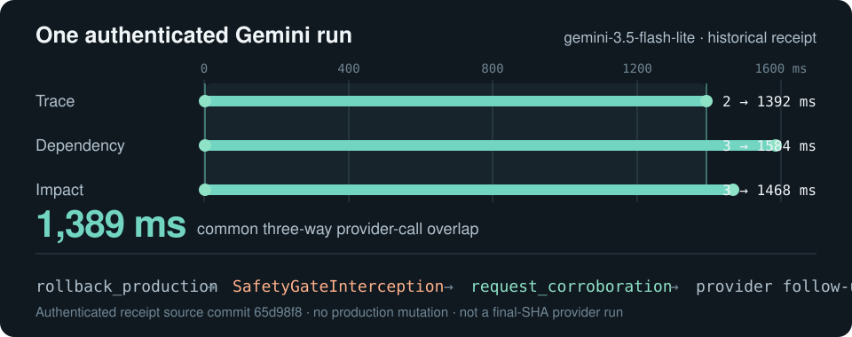

<h1>
  <picture>
    <source media="(prefers-color-scheme: dark)" srcset="docs/assets/wordmark-dark.svg" />
    
  </picture>
</h1>

### Concurrent incident response that rejects stale plans.

IncidentMesh runs three independent investigators at the same time while an Action Controller may already be planning a response.

If new evidence arrives before that plan acts, IncidentMesh compares the revision the plan used with the current evidence revision. If they differ, the plan is stale and cannot cross the action boundary.

<picture>
  <source media="(max-width: 600px)" srcset="docs/assets/hero-narrow.svg" />
  
</picture>

**Concurrency changes which decisions are still valid.**

[Watch the demo](https://www.youtube.com/watch?v=ohw8Ybt_dIM) · [Quick start](#quick-start) · [Why concurrency matters](#why-concurrency-matters) · [Gemini evidence](#real-gemini-evidence) · [Evidence](#evidence) · [Judge guide](docs/judge-guide.md)

## Watch the 83-second demo

<a href="https://www.youtube.com/watch?v=ohw8Ybt_dIM">
  
</a>

**[Watch on YouTube](https://www.youtube.com/watch?v=ohw8Ybt_dIM)** — stale-plan invalidation, authenticated Gemini overlap, real Mozaik interception, and the seeded safety stress in one short walkthrough.

## The idea

Trace, Dependency, and Impact investigate the same incident independently. Each publishes structured evidence into shared `IncidentState`.

Every accepted evidence change advances `decisionRevision`. When the Action Controller starts a plan, that plan records `basedOnRevision`.

```text
Action Controller starts
basedOnRevision = 1
        │
        │   Dependency publishes evidence
        │   Impact publishes evidence
        ▼
current decisionRevision = 3
        │
        │   old plan returns
        ▼
1 ≠ 3  →  STALE  →  intercepted
```

The implementation is optimistic concurrency control for agent plans: do the work without blocking peers, then verify that the assumptions are still current before the action crosses the boundary.

## Why concurrency matters

The stale-plan ablation keeps the incident, eventual evidence, planner, policy, candidate action, target, and configured planning duration the same. Only peer-evidence scheduling changes.

| Same revision-1 plan | Concurrent | Serialized |
| --- | --- | --- |
| Peer evidence changes while planning | yes | no |
| Revision at the action boundary | 3 | 1 |
| Plan still fresh | **no** | **yes** |
| Bounded `targeted_canary_probe` crosses | **no** | **yes** |
| Result | `request_corroboration` + fresh replan | proposal-only bounded diagnostic |
| Destructive rollback authorized | **no** | **no** |
| Eventual evidence | same | same |

In the concurrent arm, other responders advance the state while the planner is still working, so the revision-1 proposal is stale when it returns. In the serialized arm, the same bounded proposal is still fresh at that moment.

The later evidence is identical in both arms. The difference is scheduling.

[Read the causal receipt](docs/evidence/stale-plan-ablation.md) · [Inspect the JSON](docs/evidence/stale-plan-ablation.json)

## Real Gemini evidence

A fresh authenticated Google `gemini-3.5-flash-lite` capture against frozen release runtime `e98376445c42ea532cbe4993095911d932a3a57a` records Trace, Dependency, and Impact provider calls in flight together for **1,363 ms**. All three responder hypotheses were accepted and the shared gate reached `BLOCKED`.

That release-SHA run is deliberately scoped to **Phase 1**: its stochastic Phase-2 execution did not propose `rollback_production`, so it does not claim a fresh authenticated interception rewrite. [Release-SHA Phase-1 receipt](docs/evidence/release-phase1-provider-run.md) · [Scoped manifest](docs/evidence/release-phase1-provider-manifest.json)

The earlier authenticated run below remains the evidence for the complete provider-backed Phase-2 path.

<picture>
  <source media="(max-width: 600px)" srcset="docs/assets/gemini-proof-narrow.svg" />
  
</picture>

That historical run records all three responder provider calls in flight together for **1,389 ms**, then records the Action Controller proposing `rollback_production`, Mozaik's `SafetyGateInterception` rewriting it to `request_corroboration`, the safe tool executing, and a provider follow-up.

It remains tied to its recorded source commit; it is not relabeled as release-SHA Phase-2 evidence. Neither provider receipt claims simultaneous token generation inside the provider.

[Historical full receipt](docs/evidence/real-provider-run.md) · [Historical raw JSON](docs/evidence/real-provider-run.json)

## Proof at a glance

- **Fresh release-SHA concurrency:** three authenticated Gemini responder calls against `e983764...` have **1,363 ms** of common provider-call overlap.
- **Authenticated Phase 2:** the historical full receipt records `rollback_production` being intercepted and rewritten to `request_corroboration`, followed by provider continuation.
- **Concurrency changes correctness:** the same revision-1 plan becomes stale under concurrent peer progress but remains fresh at the serialized boundary.
- **Stress tested:** 10,000 seeded cases / 40,000 immutable action attempts record **0 unauthorized rollback crossings** and **0 stale non-safe crossings**.

The repository keeps release-SHA Phase-1 evidence, the historical full provider receipt, deterministic counterfactuals, and stress evidence separate so each claim has a clear provenance.

## Quick start

Node.js 20+ is required. No provider key is needed for the default demo.

```bash
git clone https://github.com/1337isnot1337/incidentmesh.git
cd incidentmesh
npm ci
npm run demo
```

Then run the causal comparison:

```bash
npm run ablation:stale-plan
```

For the broader verification suite:

```bash
npm run verify
npm run stress:safety
```

[](https://github.com/1337isnot1337/incidentmesh/actions/workflows/ci.yml)  

## How it works

1. **Investigate concurrently.** One `incident.opened` event wakes Trace, Dependency, and Impact. None waits for another responder.
2. **Version the evidence.** Accepted action-relevant evidence advances `decisionRevision`.
3. **Stamp the plan.** The Action Controller records the revision and evidence it actually reasoned over.
4. **Check again at the boundary.** Every action attempt gets an immutable snapshot. A stale bounded or destructive proposal cannot execute.
5. **Apply action-specific policy.** Safe corroboration stays available; bounded diagnostics require fresh strong evidence; destructive rollback remains strict and fail-closed.

Built directly on **Mozaik 4.0.5** using typed shared state, independent participants, semantic events, situation handlers, `runLoop`, and function-call interception.

[Implementation details](docs/implementation.md) · [Claim-by-claim judge map](docs/hackathon/judge-proof-map.md)

## Evidence

| Question | Best artifact |
| --- | --- |
| What is the fastest overview? | [83-second video demo](https://www.youtube.com/watch?v=ohw8Ybt_dIM) |
| Did real model requests overlap on the frozen release runtime? | [Release-SHA Phase-1 Gemini receipt](docs/evidence/release-phase1-provider-run.md) |
| Did the authenticated provider path include the Phase-2 interception? | [Historical full Gemini receipt](docs/evidence/real-provider-run.md) |
| Does concurrency change what action is valid? | [Stale-plan ablation](docs/evidence/stale-plan-ablation.md) |
| Does Mozaik actually intercept the action? | [Canonical replay](docs/evidence/replay.svg) |
| Does the policy survive adversarial ordering? | [Safety stress receipt](docs/evidence/safety-stress.md) |
| What happens when a responder hangs or misses its deadline? | [Degradation receipt](docs/evidence/degradation.md) |
| What exactly is being claimed? | [Judge proof map](docs/hackathon/judge-proof-map.md) |

For a short verification path, see **[IncidentMesh in 5 minutes](docs/judge-guide.md)**.

## Scope

IncidentMesh is a hackathon incident-response prototype, not a production integration.

- The fresh release-SHA Gemini capture proves authenticated Phase-1 provider overlap only; its stochastic Phase 2 did not propose `rollback_production`.
- The historical authenticated Gemini receipt remains the complete provider-backed Phase-2 interception/follow-up artifact from its recorded commit.
- The stale-plan counterfactual replays frozen provider hypotheses under deterministic schedules.
- `targeted_canary_probe` and `rollback_production` are proposal-only fixtures; no tool changes production.
- The project does not claim production readiness, MTTR improvement, generic speedup, or dynamic editing of prompts already in flight.

## Hackathon

Built for the JigJoy × daily.dev × Hyperskill concurrent-agents hackathon.

[Public JigJoy entry](https://build.jigjoy.ai/gallery/incidentmesh-40ad9c) · [Video demo](https://www.youtube.com/watch?v=ohw8Ybt_dIM) · [Judge package](docs/hackathon/) · [Full implementation notes](docs/implementation.md)


