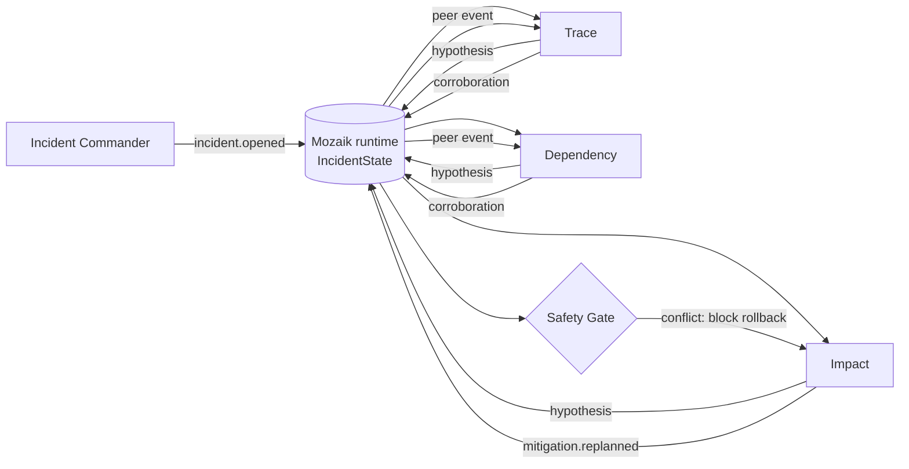

<p align="center">
  
</p>

<h1 align="center">IncidentMesh</h1>

<p align="center"><strong>Concurrent incident-response agents that investigate in parallel, coordinate through shared state, and block unsafe action.</strong></p>

<p align="center">
  <a href="https://github.com/1337isnot1337/incidentmesh/actions/workflows/ci.yml"></a>
  
  
  
</p>

<p align="center">
  <a href="#demo">Demo</a> ·
  <a href="#quick-start">Quick start</a> ·
  <a href="#how-it-works">Architecture</a> ·
  <a href="#evidence">Evidence</a> ·
  <a href="#development">Development</a>
</p>

<p align="center">
  
</p>

IncidentMesh is an architectural prototype for incident response on [Mozaik](https://mozaik.jigjoy.ai/). One incident event wakes three independent responders: **Trace**, **Dependency**, and **Impact**. They work on different evidence streams at the same time, publish hypotheses into one `IncidentState`, observe peer events, and trigger a shared **Safety Gate**. When the evidence conflicts, the gate prevents rollback and the room replans to a canary with corroboration.

The default demo is deterministic and needs no API key. It uses a scripted incident fixture so concurrency, state changes, and safety behavior are reproducible.

## Demo

```bash
npm ci
npm run demo
```

A representative verified run:

```text
Trace       ███████████████            2–122ms
Dependency  █████████████████████      3–172ms
Impact      ███████████████████████████ 3–222ms

3 / 3 responder pairs overlap
Safety Gate: BLOCKED — 2 conflicting causes, 0.74 aggregate confidence
Adaptation: rollback -> canary + corroboration
Evidence after adaptation: 2
Latency proxy: ~2.3× summed responder work / concurrent wall time
```

The exact millisecond values vary slightly by machine. The event ordering, overlap, blocked gate, adaptive canary, and two corroboration responses are deterministic.

See [`docs/demo.md`](docs/demo.md) for the 90-second judge narration.

## Why concurrency is the point

Telemetry, dependency health, and customer impact do not arrive in a useful fixed order during an incident. Serializing them adds avoidable latency and prevents an early finding from being visible while another investigation is still running.

IncidentMesh is not one agent executing three prompts in sequence:

- Trace, Dependency, and Impact are separate Mozaik participants with independent handlers and lifecycles.
- One `incident.opened` semantic event wakes all three; no responder waits for another to finish.
- Peer hypothesis events fan out while other responders are still active.
- The Safety Gate computes a decision from aggregate shared state, not a prewritten next step.
- A blocked decision emits a new event that changes Impact's plan; Trace and Dependency then react to that plan.
- The default run measures responder spans and asserts all three pairwise overlaps in tests.

## Quick start

Requires Node.js 20 or newer.

```bash
git clone https://github.com/1337isnot1337/incidentmesh.git
cd incidentmesh
npm ci
npm run demo
```

Other useful commands:

```bash
npm run benchmark   # reproducible latency proxy
npm run replay      # JSON event/report replay
npm run verify      # typecheck + tests + production build + built smoke check
npm run demo:built  # run the committed production build
```

## How it works



The implementation uses Mozaik 4.0.5 directly:

| Mozaik primitive | IncidentMesh use |
| --- | --- |
| `defineRuntime<IncidentState>()` | one shared runtime with typed incident state |
| `createAgent` / `createHuman` | three responders, gate, observer, commander |
| `SemanticEvent.create` / `sendEvent` | incident, hypothesis, gate, adaptation, evidence fan-out |
| `SituationSpecification` | event-driven participant reactions |
| `runLoop` | optional provider-backed responder turns |
| `InterceptionHandler` | rewrite blocked `rollback_production` calls to a safe corroboration request |
| structured output | preserve provider-reported claim, confidence, and root-cause fields |

### Safety Gate

The gate waits for one hypothesis from each responder, then aggregates confidence and counts distinct root-cause claims. In the deterministic fixture the causes conflict, so rollback is blocked.

In provider mode, `SafetyGateInterception` targets only `rollback_production`. A blocked rollback is rewritten to the registered `request_corroboration` tool, which records a proposal-only safety result. IncidentMesh never executes a production rollback.

## Evidence

`npm run benchmark` derives both values from the same measured responder spans:

| Measurement | Representative run |
| --- | ---: |
| Concurrent responder window | ~220 ms |
| Sum of the three responder intervals | ~505 ms |
| Pairwise overlaps | 3 / 3 |
| Latency proxy | ~2.3× |

The proxy asks one narrow question: how much wall-clock time is saved by overlapping the same measured work intervals? It is not an evidence-quality or model-quality benchmark.

The test suite checks the higher-value failure modes rather than inflating test count. It covers concurrent overlap, shared-state gating, adaptive follow-up, rollback-only interception, executable safe rewriting, event-driven completion, and structured model hypotheses.

## Deterministic and provider-backed modes

The provider-free path is the canonical judging demo because it is fast and reproducible. Its evidence values and controlled delays are scripted; it does **not** connect to live observability systems.

The optional provider path uses the same runtime, participants, event handlers, shared state, and safety interception, while replacing scripted hypotheses with model output:

```bash
OPENAI_API_KEY=... RUN_MODEL=1 npm run dev
```

External telemetry adapters, paging integrations, and automatic production actions are intentionally outside this prototype. The boundaries are explicit: replace the fixture with real signal adapters without changing the concurrency and gate model.

## Development

```bash
npm run typecheck
npm test
npm run build
npm run verify:built
```

`dist/` is intentionally committed. Judges can inspect or run the built JavaScript without trusting an unpublished package, while `src/` remains the source of truth.

Project and hackathon audit material is kept out of the product root under [`docs/hackathon/`](docs/hackathon/). The software remains `UNLICENSED`; no license has been chosen on the owner's behalf.

## Hackathon

IncidentMesh targets the JigJoy × daily.dev × Hyperskill concurrent-agents hackathon. The repository's rule snapshot and submission copy are preserved under [`docs/hackathon/`](docs/hackathon/). The official competition submission is intentionally a separate operator action.
