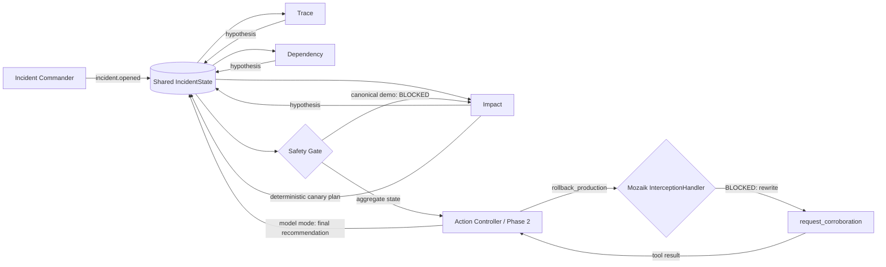

<p align="center">
  
</p>

<h1 align="center">IncidentMesh</h1>

<p align="center"><strong>Three independent investigators disagree, and that disagreement changes what the system is allowed to do.</strong></p>

<p align="center">
  <a href="https://github.com/1337isnot1337/incidentmesh/actions/workflows/ci.yml"></a>
  
  
  
</p>

<p align="center">
  <a href="#demo">Demo</a> ·
  <a href="#judge-verification">Verification</a> ·
  <a href="#how-it-works">Architecture</a> ·
  <a href="#measured-overlap">Measured overlap</a> ·
  <a href="#development">Development</a>
</p>

<p align="center">
  
</p>

IncidentMesh is a concurrent incident-response prototype built on [Mozaik](https://mozaik.jigjoy.ai/). **Trace**, **Dependency**, and **Impact** investigate different evidence streams at the same time. Their hypotheses enter one typed `IncidentState`. In the deterministic scenario, the three root-cause hypotheses are distinct, producing **two contradictions**. That aggregate disagreement blocks rollback, causes Impact to replan to a canary, and causes Trace and Dependency to add corroborating evidence.

```text
parallel investigation
        ↓
3 distinct root-cause hypotheses
        ↓
2 contradictions enter shared state
        ↓
SAFETY GATE: BLOCKED
        ↓
Impact replans → canary
        ↓
Trace + Dependency → corroboration
```

The default demo is deterministic and needs no API key. Its purpose is to make the concurrency and causal state transitions reproducible.

## Demo

```bash
npm ci
npm run demo
```

A representative run reaches this sequence:

```text
Trace       ───────────────┐
Dependency  ─────────────────────┐   3 / 3 responder pairs overlap
Impact      ───────────────────────────┐
                                 │
3 hypotheses → 2 contradictions → SAFETY GATE: BLOCKED
                                 ↓
                         Impact: canary plan
                                 ↓
                  Trace + Dependency: corroboration
```

The exact millisecond values vary slightly by machine. The responder overlap, three hypotheses, two contradictions, blocked gate, adaptive canary, and two follow-up evidence responses are deterministic.

The deterministic demo now traverses the actual Mozaik function-call loop. At the fixed action boundary, the gate evaluates the evidence already in shared state and becomes blocked; Mozaik then emits `interception.started`, `SafetyGateInterception` rewrites the call to `request_corroboration`, Mozaik emits `interception.finished`, and the registered safe tool executes before Impact replans to a canary. This is framework execution, not a printed simulation of interception.

See [`docs/demo.md`](docs/demo.md) for the 90-second judge narration.

## Judge verification

The important claims are directly inspectable:

| Claim | Where the repository proves it |
| --- | --- |
| Three separate responders actually overlap | `runIncidentScenario()` emits independent responder spans; the demo prints all three; tests require `overlapCount(report) === 3` |
| Peer observations happen while work is active | `awareness.peer-observed` events are emitted on peer hypotheses; the concurrency test requires multiple observations to occur inside the observer's active span |
| Hypotheses enter shared typed state | `IncidentState.hypotheses: Hypothesis[]`; `gateHandlers()` records one hypothesis per role |
| Aggregate disagreement causes the gate decision | three distinct `rootCause` values produce `contradictions === 2`; `gateHandlers()` then emits `incident.gate.decision = blocked` |
| The gate decision changes another participant's behavior | Impact's `blockedAdaptation` handler reacts to the blocked decision and emits `incident.mitigation.replanned` |
| The new plan causes peer follow-up evidence | Trace and Dependency react to `mitigation.replanned` and emit `incident.evidence.added` |
| Blocked rollback is intercepted end to end | the canonical zero-key demo emits Mozaik `interception.started` / `interception.finished`, then executes `request_corroboration`; tests assert the same path |


## Causal concurrency ablation

`npm run ablation` asks the stronger question: **does concurrent evidence change the action outcome, not merely the runtime?**

The experiment holds constant the incident, all three evidence items, their confidence values, the gate rule, the proposed `rollback_production` action, and a fixed 205 ms action boundary. It changes only when responder evidence becomes available.

| At the same 205 ms boundary | Concurrent evidence | Sequential evidence |
| --- | --- | --- |
| Hypotheses available | 3 | 1 |
| Contradictions available | 2 | 0 |
| Gate decision | `BLOCKED` | `APPROVED` |
| Mozaik interception | yes | no |
| Tool that crosses the boundary | `request_corroboration` | `rollback_production` |
| Final evidence after all responders finish | same 3 hypotheses / 2 contradictions | same 3 hypotheses / 2 contradictions |
| Final gate state | `BLOCKED` | `BLOCKED`, but after the action boundary |

The sequential case is not a different policy or weaker evidence set. Its later responders run the same deterministic work with the same confidence values; their contradictory evidence simply arrives after the action boundary. The rollback tool is proposal-only, so this demonstrates a control-flow escape across the safety boundary, not an actual production rollback.

This is the project's main causal claim: **parallel evidence is available soon enough to change which function call Mozaik executes.**

## Why concurrency is the point

Telemetry, dependency health, and customer impact are independent evidence streams. Serializing them adds avoidable latency and prevents an early finding from becoming visible while another investigation is still active.

IncidentMesh is not one agent executing three prompts in sequence:

- Trace, Dependency, and Impact are separate Mozaik participants with independent handlers and lifecycles.
- One `incident.opened` semantic event wakes all three; no responder waits for another to finish.
- Peer hypothesis events fan out through runtime handlers while responder work is still in flight; this is runtime awareness, not a claim that the Phase-1 LLMs receive peer hypotheses.
- The Safety Gate computes a decision from shared state, not a prewritten next step.
- In the canonical zero-key demo, a blocked gate drives deterministic canary replanning and follow-up corroboration.
- In model mode, aggregate evidence opens a separate Phase-2 Action Controller loop whose prompt contains all three shared hypotheses and the gate state.

## Quick start

Requires Node.js 20 or newer.

```bash
git clone https://github.com/1337isnot1337/incidentmesh.git
cd incidentmesh
npm ci
npm run demo
```

Other useful commands:

```bash
npm run ablation    # same evidence/policy/deadline; scheduling changes the action outcome
npm run benchmark   # supporting measured overlap/latency proxy
npm run replay      # JSON event/report replay
npm run replay:visual # generated SVG + JSON canonical replay
npm run degradation  # Dependency timeout remains fail-closed
npm run provider:evidence:check # inspect provider/model + credential availability; does not execute
npm run verify      # typecheck + tests + production build + built smoke check
npm run demo:built  # run the committed production build
```

## How it works



The implementation uses Mozaik 4.0.5 directly:

| Mozaik primitive | IncidentMesh use |
| --- | --- |
| `defineRuntime<IncidentState>()` | one shared runtime with typed incident state |
| `createAgent` / `createHuman` | three responders, Action Controller, gate, observer, commander |
| `SemanticEvent.create` / `sendEvent` | incident, hypothesis, gate, adaptation, evidence fan-out |
| `SituationSpecification` | event-driven participant reactions |
| `runLoop` | provider-backed Phase-1 responder turns plus the post-aggregation Phase-2 mitigation turn |
| `InterceptionHandler` | inspect rollback function-call transitions at the action boundary |
| structured output | preserve provider-reported claim, confidence, and root-cause fields |

### Safety Gate and action phase

The gate aggregates confidence and counts disagreement as the number of distinct root-cause hypotheses minus one. In the canonical deterministic fixture there are three distinct root-cause hypotheses, so `contradictions === 2`. At the fixed action boundary, the gate evaluates whatever evidence is already available; that timing is what makes the causal ablation meaningful.

`SafetyGateInterception` targets only `rollback_production`. In the canonical zero-key demo, the pending rollback reaches Mozaik's function-call transition after the gate blocks, is rewritten to the registered proposal-only `request_corroboration` tool, and the safe tool executes through the normal function-call state. Impact's subsequent canary replan is deterministic application logic, not an LLM reconsideration. IncidentMesh never performs a real production rollback.

Model mode uses a genuine second phase instead of expecting a terminal investigation turn to act later. After all three structured Phase-1 hypotheses enter shared state, the Safety Gate evaluates the aggregate evidence and starts a dedicated Action Controller `runLoop`. Its prompt contains the three shared hypotheses and the current gate state. If that model emits `rollback_production`, the same `SafetyGateInterception` is on the live transition; if it is rewritten to `request_corroboration`, the tool result returns to the Action Controller loop and its later `model.answer` is recorded as the model recommendation. A scripted `InferenceRunner` integration test proves this lifecycle is structurally reachable without claiming a real-provider execution.

## Measured overlap

`npm run benchmark` reports one supporting concurrency metric:

```text
latency/overlap proxy
= sum of measured responder durations / concurrent wall time
≈ 2.3× in the deterministic fixture
```

A representative run measures about 219–220 ms of concurrent wall time and about 505–508 ms when the three measured responder durations are summed. All three responder pairs overlap.

This ratio is only an overlap/latency proxy. It does **not** establish 2.3× better reasoning, throughput, MTTR, or production performance. It is deliberately secondary to the causal demonstration that disagreement changes the allowed action.

## Deterministic and provider-backed modes

The provider-free path is the canonical judging demo because it is fast and reproducible. Its evidence values and controlled delays are scripted; it does **not** connect to live observability systems.

The optional model path replaces scripted Phase-1 hypotheses with structured model output, then starts a separate Phase-2 Action Controller only after aggregate evidence has produced a gate decision:

```bash
OPENAI_API_KEY=... RUN_MODEL=1 npm run dev
```

Phase-1 peer events are observed by runtime handlers, but those peer hypotheses are not injected into the other Phase-1 responder models and do not trigger extra inference. The Phase-2 Action Controller is the model that receives cross-participant evidence: its prompt is built from all shared hypotheses plus the current gate decision. The same `SafetyGateInterception` is attached to that Phase-2 `runLoop`, making a post-aggregation rollback transition genuinely interceptable.

The repository has a scripted model-mode integration test for this two-phase lifecycle. That test uses Mozaik's real agent loop, interception manager, rewritten function transition, tool execution, and follow-up `model.answer`, but it is not authenticated provider evidence. No successful real-provider run is claimed unless sanitized evidence is captured and committed separately.

Provider evidence capture is safe-by-default: `npm run provider:evidence:check` only inspects model/provider selection and credential-variable availability. `npm run provider:evidence:capture` explicitly opts into one bounded provider execution, writes files only after a successful run, and validates the staged JSON/Markdown for common credential patterns and private filesystem paths before copying them into `docs/evidence/`. No such real-provider evidence is currently committed.

The CLI checks the selected model's provider credential before starting model loops. With the default `gpt-5.5`, a missing `OPENAI_API_KEY` exits with an explicit error and emits no IncidentReport. For inference failures after startup, Mozaik 4.0.5 exposes `runLoop(): void`, so the CLI uses a process-level `unhandledRejection` boundary to terminate nonzero rather than misreport success; library-level Promise recovery is not available through the current API.

External telemetry adapters, paging integrations, and automatic production actions are outside this prototype. The concurrency and safety-control architecture is the part under test.

## Fail-closed degradation

`npm run degradation` simulates one realistic failure: the Dependency responder starts, times out before publishing a hypothesis, and records that missing evidence in shared state. Trace and Impact continue. Because the missing Dependency signal is known, the Safety Gate fails closed at the action boundary, Mozaik still rewrites `rollback_production` to `request_corroboration`, Impact replans to a canary, and Trace supplies the surviving corroboration.

This is intentionally narrow. IncidentMesh does not claim generic fault tolerance or dynamic-agent recovery.

## Development

```bash
npm run typecheck
npm test
npm run build
npm run verify:built
```

The twelve focused tests cover responder overlap, active peer observations, shared-state gating, adaptive follow-up, end-to-end interception, executable safe rewriting, event-driven completion, structured model hypotheses, stable timeout snapshots, and the fixed-boundary causal ablation across combined assertions.

`dist/` is intentionally committed. Judges can inspect or run the built JavaScript without trusting an unpublished package, while `src/` remains the source of truth.

Project and hackathon audit material is under [`docs/hackathon/`](docs/hackathon/). The software remains `UNLICENSED`; no license has been chosen on the owner's behalf.

## Hackathon

IncidentMesh targets the JigJoy × daily.dev × Hyperskill concurrent-agents hackathon. The repository's rule snapshot and submission copy are preserved under [`docs/hackathon/`](docs/hackathon/). The official competition submission remains a separate operator action.
