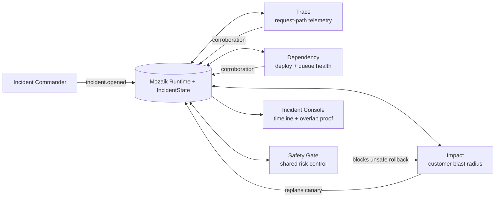

# IncidentMesh

IncidentMesh is a live incident-response room built on Mozaik 4.0.5. When a checkout outage opens, three independent responders investigate different signal streams at the same time. They publish hypotheses into one shared runtime; a Safety Gate sees the disagreement, blocks an unsafe rollback, and the room adapts to a canary-and-corroboration plan.

This is a concurrency demo with a useful job: incident response cannot afford to wait for telemetry, dependency health, and customer impact analysis to arrive in a fixed chain.

## 30-second architecture



Each participant joins one runtime with a manifest and situation handlers. `incident.opened` wakes all responders independently. `hypothesis.emitted` updates shared confidence and contradictions. The gate reacts to the resulting state; the responders react to the gate's decision. There is no planner → worker → reviewer DAG.

## Quick start

Requires Node 20+.

```bash
npm install
npm run check
npm run demo
```

The default path is deterministic and provider-free. It prints a readable event timeline, participant spans, overlap count, the gate decision, the adaptive replanning step, and the final recommendation.

```bash
npm run benchmark
npm run replay
```

To run the same event-driven responders with a real provider, supply the provider credential privately and opt in explicitly:

```bash
OPENAI_API_KEY=... RUN_MODEL=1 npm run dev
```

The key is read by the provider SDK and is never printed or committed. The demo does not require a key.

## What makes the concurrency real

- `defineRuntime<IncidentState>()` creates a shared Mozaik runtime and typed shared state.
- Three `createAgent` participants all react to the same `incident.opened` semantic event.
- Their processors start fire-and-forget investigations immediately. The deterministic run starts Trace, Dependency, and Impact within a few milliseconds, then completes them at different times.
- Every hypothesis fans out to the other participants. The timeline records `awareness.peer-observed` while peers are still active.
- The Safety Gate computes shared confidence and contradictory root causes. Its decision is caused by the aggregate runtime state, not a fixed next step.
- Impact reacts to a blocked decision and emits a new mitigation plan. Trace and Dependency then react to that new event and add corroborating evidence.

## Mozaik features used

This project targets the current `@mozaik-ai/core` 4.0.5 API:

- `defineRuntime` and `RuntimeState`
- participant manifests via `createAgent` and `createHuman`
- semantic events via `SemanticEvent.create` and `sendEvent`
- situation handlers via `SituationSpecification`
- optional real-model `runLoop` calls, one per responder
- `InterceptionHandler`: `SafetyGateInterception` rewrites a risky `rollback_production` function call into `request_corroboration` whenever shared state is blocked

## Demo scenario

The deterministic incident has three deliberately different perspectives:

| Participant | Unique contribution | Wake-up / adaptation |
| --- | --- | --- |
| Trace | latency and request-path signal | starts on outage; observes peer hypotheses |
| Dependency | deploy, database-pool, and queue signal | starts on outage; corroborates a canary |
| Impact | user-visible blast radius | changes rollback to canary after gate blocks |
| Safety Gate | risk aggregation and control | reacts after all three hypotheses exist |

The complete narration is in [DEMO.md](DEMO.md).

## Evidence

A representative run produces:

```text
Trace        ███████████████ 1–121ms
Dependency   █████████████████████ 2–173ms
Impact       ███████████████████████████ 2–220ms
overlapping responder pairs: 3 / 3
concurrency speedup proxy: 2.31× sequential work / wall time
gate: BLOCKED — 2 conflicting causes at 0.74 confidence
```

The benchmark uses the same measured responder intervals: concurrent wall time is the longest interval; the sequential baseline is their sum. It is a latency comparison, not a claim that concurrency magically improves evidence quality.

## Tests and limitations

```bash
npm run typecheck
npm test
npm run build
npm run verify:built
```

Tests assert that all three responders overlap, shared state causes a gate decision and adaptive follow-up, and the safety interception rewrites a risky action. The dry-run uses a scripted incident fixture rather than live telemetry. Real provider output is accepted as a hypothesis, but external observability integrations and automatic production actions are intentionally out of scope for this hackathon prototype.

## Hackathon

The verified event rules and deadline are captured in [HACKATHON_RULES.md](HACKATHON_RULES.md). The concept decision is recorded in [CONCEPT.md](CONCEPT.md).
