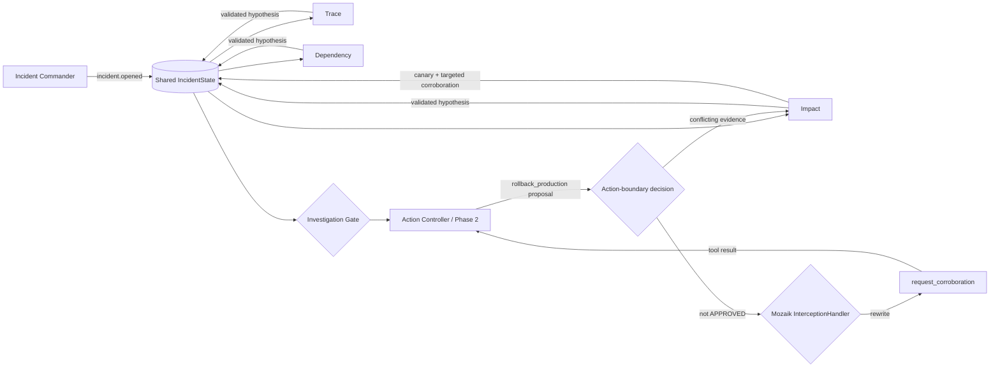

<p align="center">
  
</p>

<h1 align="center">IncidentMesh</h1>

<p align="center"><strong>Three independent investigators disagree, and that disagreement changes what the system is allowed to do.</strong></p>

<p align="center">
  <a href="https://github.com/1337isnot1337/incidentmesh/actions/workflows/ci.yml"></a>
  
  
  
</p>

<p align="center">
  <a href="#demo">Demo</a> ·
  <a href="#judge-verification">Verification</a> ·
  <a href="#how-it-works">Architecture</a> ·
  <a href="#measured-overlap">Measured overlap</a> ·
  <a href="#development">Development</a>
</p>

<p align="center">
  
</p>

IncidentMesh is a concurrent incident-response prototype built on [Mozaik](https://mozaik.jigjoy.ai/). **Trace**, **Dependency**, and **Impact** investigate separate evidence streams at the same time. Their hypotheses enter one typed `IncidentState`. In the canonical deterministic fixture, all three root-cause hypotheses are present before the production action boundary and are distinct, producing **two contradictions**. The Safety Gate blocks the rollback for conflicting evidence, Mozaik rewrites the rollback proposal to `request_corroboration`, and the system can immediately select a canary plus targeted corroboration.

```text
parallel investigation
        ↓
3 required hypotheses before the action boundary
        ↓
2 contradictions enter shared state
        ↓
SAFETY GATE: BLOCKED — conflicting-evidence
        ↓
rollback_production intercepted → request_corroboration
        ↓
Impact → canary + targeted corroboration
        ↓
Trace + Dependency → corroboration
```

The default demo is deterministic and needs no API key. Its evidence values and controlled delays are scripted so the causal state transitions are reproducible.

## Demo

```bash
npm ci
npm run demo
```

A representative run reaches this sequence:

```text
Trace       ───────────────┐
Dependency  ─────────────────────┐   3 / 3 responder pairs overlap
Impact      ───────────────────────────┐
                                 │
3 hypotheses → 2 contradictions → BLOCKED — conflicting-evidence
                                 ↓
                     immutable action-boundary snapshot
                                 ↓
       rollback → request_corroboration → canary → corroboration
```

The exact millisecond values vary slightly by machine. The responder overlap, three hypotheses, two contradictions, blocked conflict decision, interception, canary path, and two follow-up evidence responses are deterministic.

The deterministic demo traverses the actual Mozaik function-call loop. At the action boundary, IncidentMesh freezes the evidence and safety reason for that action. `SafetyGateInterception` permits `rollback_production` only when the effective action decision is affirmatively `approved`; `pending` and `blocked` are both unsafe. Mozaik emits `interception.started`, the handler rewrites the call to `request_corroboration`, Mozaik emits `interception.finished`, and the registered safe tool executes. This is framework execution, not display-only simulation.

See [`docs/demo.md`](docs/demo.md) for the 90-second judge narration.

## Judge verification

The important claims are directly inspectable:

| Claim | Where the repository proves it |
| --- | --- |
| Three separate responders actually overlap | `runIncidentScenario()` emits independent responder spans; the demo prints all three; tests require `overlapCount(report) === 3` |
| Peer observations happen while work is active | `awareness.peer-observed` events are emitted on peer hypotheses while responder spans are active |
| Hypotheses enter shared typed state | `IncidentState.hypotheses: Hypothesis[]`; gate handlers accept one authoritative hypothesis per registered role |
| Role claims are bound to producer identity | `registerResponder()` binds each role to its Mozaik participant ID; spoofed or unknown-role evidence is rejected |
| Invalid confidence cannot improve safety posture | evidence requires a finite numeric confidence in `[0,1]`; malformed evidence is rejected and the required role remains unavailable/degraded |
| Duplicate role evidence cannot double-count | first authoritative hypothesis for each role wins for the phase |
| Waiting and action safety are distinct | incomplete investigation evidence remains `PENDING`; the same state becomes `BLOCKED — incomplete-required-evidence` when rollback reaches the action boundary |
| The action-boundary decision is immutable | `ActionBoundarySnapshot` freezes available/missing roles, confidence, contradictions, decision, reason, and proposed action before execution |
| Late evidence remains visible without rewriting history | later hypotheses update the investigation state but do not mutate the frozen boundary snapshot |
| Rollback is intercepted end to end | both conflict and incomplete-evidence paths traverse Mozaik interception and execute `request_corroboration`; tests assert rollback itself does not execute |
| Model-mode interception is structurally reachable | a separate post-aggregation Action Controller `runLoop` receives shared evidence and traverses the same interceptor in scripted integration tests |

## Causal concurrency ablation

`npm run ablation` asks a narrow causal question: **with the same fail-closed policy, does evidence scheduling change what the system can safely do at the fixed action boundary?**

The experiment holds constant the incident, all three evidence items, confidence values, root causes, gate policy, proposed `rollback_production` action, and a fixed 205 ms action boundary. It changes only evidence scheduling.

| At the same 205 ms boundary | Concurrent evidence | Sequential evidence |
| --- | --- | --- |
| Required hypotheses available | 3 | 1 |
| Missing required roles | none | Dependency, Impact |
| Contradictions visible | 2 | 0 |
| Boundary decision | `BLOCKED` | `BLOCKED` |
| Boundary reason | `conflicting-evidence` | `incomplete-required-evidence` |
| Mozaik interception | yes | yes |
| Tool executed | `request_corroboration` | `request_corroboration` |
| Safe control path at boundary | canary + targeted corroboration | hold for missing evidence |
| Conflict-informed canary available | immediately at boundary | only after the remaining identical evidence arrives |
| Final investigation evidence | same 3 hypotheses / 2 contradictions | same 3 hypotheses / 2 contradictions |
| Final investigation state | `BLOCKED — conflicting-evidence` | `BLOCKED — conflicting-evidence` |

Same evidence. Same gate. Same action deadline. Only scheduling changes. Parallel evidence reveals the conflict in time to choose a targeted canary response; serialized evidence leaves the gate incomplete, so it safely holds the action until the missing signal arrives.

No arm authorizes production from incomplete evidence. **Concurrency changes control flow, not merely wall time.** In this fixture it changes the reason for blocking and the safe plan available at the boundary: complete contradictory evidence supports a specific canary-and-corroboration path, while incomplete evidence supports only a conservative hold.

`npm run ablation` also reports **time to actionable safe mitigation**: the measured fixture time at which the conflict-informed canary plan first becomes available. This is not MTTR and is not presented as an operational production-speedup claim.

## Why concurrency is the point

Telemetry, dependency health, and customer impact are independent evidence streams. Serializing them delays when the shared state becomes complete enough to distinguish a concrete conflict from simple missing evidence.

IncidentMesh is not one agent executing three prompts in sequence:

- Trace, Dependency, and Impact are separate Mozaik participants with independent handlers and lifecycles.
- One `incident.opened` semantic event wakes all three in the concurrent fixture.
- Peer hypothesis events fan out through runtime handlers while responder work is still in flight; this is runtime awareness, not a claim that the Phase-1 LLMs receive peer hypotheses.
- The Safety Gate computes an evolving investigation state from shared evidence.
- A separate action-boundary evaluation freezes the safety decision for the proposed action; later evidence cannot rewrite that record.
- In the canonical zero-key demo, complete conflicting evidence selects the deterministic canary-and-targeted-corroboration path.
- In model mode, aggregate evidence opens a separate Phase-2 Action Controller loop whose prompt contains shared hypotheses and gate state.

## Quick start

Requires Node.js 20 or newer.

```bash
git clone https://github.com/1337isnot1337/incidentmesh.git
cd incidentmesh
npm ci
npm run demo
```

Other useful commands:

```bash
npm run ablation    # same evidence/policy/deadline; only scheduling changes
npm run benchmark   # supporting measured overlap/latency proxy
npm run replay      # JSON event/report replay
npm run replay:visual # generated SVG + JSON canonical replay
npm run degradation  # missing required evidence remains fail-closed
npm run provider:evidence:check # inspect provider/model + credential availability; does not execute
npm run verify      # typecheck + tests + production build + built smoke check
npm run demo:built  # run the committed production build
```

## How it works



The implementation uses Mozaik 4.0.5 directly:

| Mozaik primitive | IncidentMesh use |
| --- | --- |
| `defineRuntime<IncidentState>()` | one shared runtime with typed incident state |
| `createAgent` / `createHuman` | three responders, Action Controller, gate, observer, commander |
| `SemanticEvent.create` / `sendEvent` | incident, hypothesis, gate, degradation, adaptation, and evidence fan-out |
| `SituationSpecification` | event-driven participant reactions |
| `runLoop` | provider-backed Phase-1 responder turns plus post-aggregation Phase-2 mitigation |
| `InterceptionHandler` | inspect rollback function-call transitions at the action boundary |
| structured output | request provider-reported claim, confidence, and root-cause fields before validation |

### Safety Gate and action phase

The gate counts disagreement as the number of distinct authoritative root-cause hypotheses minus one. Before an action is attempted, missing required evidence is an evolving investigation state: `PENDING — pending-required-evidence`. At a production action boundary, absence of required evidence is not treated as safety. The action evaluation becomes `BLOCKED — incomplete-required-evidence`. Complete evidence with disagreement becomes `BLOCKED — conflicting-evidence`; complete consistent evidence with sufficient aggregate confidence may become `APPROVED — sufficient-consistent-evidence`.

The frozen `ActionBoundarySnapshot` records when the boundary was reached, the evolving investigation state seen then, authoritative roles available, missing required roles, degraded roles, confidence, contradictions, the action decision/reason, and the proposed rollback. The report separately records the interception result and executed tool. Late evidence may change the final investigation state and make a more specific safe plan available, but it does not mutate the historical boundary snapshot.

`SafetyGateInterception` targets only `rollback_production` and fails closed: only an affirmative `approved` action decision lets the proposal pass. In the canonical zero-key demo, the pending rollback reaches Mozaik's function-call transition after complete conflicting evidence is known, is rewritten to the registered proposal-only `request_corroboration` tool, and that safe tool executes through the normal function-call state. IncidentMesh never performs a real production rollback.

Model mode uses a genuine second phase instead of expecting a terminal investigation turn to act later. Phase-1 model hypotheses are validated before entering shared state. After aggregate evidence produces a gate result, a dedicated Action Controller `runLoop` receives the accepted shared hypotheses and current gate state. If that model emits `rollback_production`, the same `SafetyGateInterception` is on the live transition. If rewritten to `request_corroboration`, the tool result returns to the Action Controller and its later `model.answer` is recorded as the model recommendation. Scripted `InferenceRunner` tests prove this lifecycle is structurally reachable without claiming a real-provider execution.

## Measured overlap

`npm run benchmark` reports one supporting concurrency metric:

```text
latency/overlap proxy
= sum of measured responder durations / concurrent wall time
≈ 2.3× in the deterministic fixture
```

A representative run measures roughly 219–220 ms of concurrent responder wall time and roughly 505–508 ms when the measured responder durations are summed. All three responder pairs overlap.

This ratio is only an overlap/latency proxy. It does **not** establish 2.3× better reasoning, throughput, MTTR, or production performance. It is secondary to the fixed-boundary causal result.

## Deterministic and provider-backed modes

The provider-free path is the canonical judging demo because it is fast and reproducible. Its evidence values and controlled delays are scripted; it does **not** connect to live observability systems.

The optional model path replaces scripted Phase-1 hypotheses with structured model output and then uses a separate Phase-2 Action Controller:

```bash
OPENAI_API_KEY=... RUN_MODEL=1 npm run dev
```

Phase-1 peer events are observed by runtime handlers, but peer hypotheses are not injected into the other Phase-1 responder models and do not trigger extra inference. Accepted model evidence must have a known role bound to the registered producer identity, a finite confidence in `[0,1]`, and non-empty claim/root-cause fields. Unknown roles, spoofed role claims, duplicates, and malformed evidence are excluded from safety calculations.

A required model responder that does not produce valid evidence before the scenario evidence deadline is explicitly degraded for that phase. Missing-at-boundary and degraded-at-deadline remain distinct: the former may still arrive later, while the latter records that its phase deadline was missed. In either case a rollback boundary without complete required evidence fails closed.

The repository has scripted model-mode integration tests for the two-phase lifecycle and for a generally hanging required responder. Those tests use Mozaik's agent loop, interception manager, rewritten function transition, tool execution, and follow-up `model.answer`; they are not authenticated provider evidence. No successful real-provider run is claimed unless sanitized evidence is captured and committed separately.

Provider evidence capture is safe-by-default: `npm run provider:evidence:check` only inspects model/provider selection and credential-variable availability. `npm run provider:evidence:capture` explicitly opts into one bounded provider execution, writes files only after a successful run, and validates staged JSON/Markdown for common credential patterns and private filesystem paths before copying them into `docs/evidence/`. No authenticated provider trace is currently committed.

The CLI checks the selected model's provider credential before starting model loops. With the default `gpt-5.5`, a missing `OPENAI_API_KEY` exits with an explicit error and emits no IncidentReport. For inference failures after startup, Mozaik 4.0.5 exposes `runLoop(): void`, so the CLI uses a process-level `unhandledRejection` boundary to terminate nonzero rather than misreport success; library-level Promise recovery is not available through the current API.

External telemetry adapters, paging integrations, and automatic production actions are outside this prototype. The concurrency and safety-control architecture is the part under test.

## Fail-closed degradation

`npm run degradation` simulates an explicit Dependency timeout before it publishes valid evidence. Trace and Impact continue. Dependency becomes explicitly degraded, the action-boundary snapshot records `BLOCKED — incomplete-required-evidence`, and Mozaik rewrites `rollback_production` to `request_corroboration`. The deterministic degraded path holds the broad rollback and records surviving Trace corroboration rather than pretending the missing Dependency signal is safe.

The model-integration tests add a more general case: a required Dependency inference runner never returns. When the evidence deadline passes, Dependency is marked degraded for the phase, its responder span is closed as unavailable, and the Action Controller still reaches the same fail-closed interception path. This is bounded phase-deadline handling; IncidentMesh does not claim arbitrary process recovery or distributed fault tolerance.

## Development

```bash
npm run typecheck
npm test
npm run build
npm run verify:built
```

Focused invariant tests cover concurrent overlap, fail-closed pending interception, complete approval, complete conflict blocking, incomplete boundary blocking, causal scheduling differences, immutable boundary snapshots, late evidence, generic hanging and explicit timeout degradation, confidence validation, producer-role binding, duplicate policy, canonical Mozaik interception, and two-phase scripted model interception.

`dist/` is intentionally committed. Judges can inspect or run the built JavaScript without trusting an unpublished package, while `src/` remains the source of truth.

Project and hackathon audit material is under [`docs/hackathon/`](docs/hackathon/). The software remains `UNLICENSED`; no license has been chosen on the owner's behalf.

## Hackathon

IncidentMesh targets the JigJoy × daily.dev × Hyperskill concurrent-agents hackathon. The repository's rule snapshot and submission copy are preserved under [`docs/hackathon/`](docs/hackathon/). The official competition submission remains a separate operator action.
