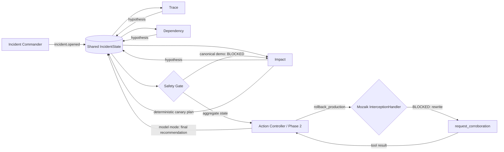

# Implementation and verification reference

Return to the [IncidentMesh README](../README.md).

## Judge verification

The important claims are directly inspectable:

| Claim | Where the repository proves it |
| --- | --- |
| Three separate responders actually overlap | `runIncidentScenario()` emits independent responder spans; the demo prints all three; tests require `overlapCount(report) === 3` |
| Peer observations happen while work is active | `awareness.peer-observed` events are emitted on peer hypotheses; the concurrency test requires multiple observations to occur inside the observer's active span |
| Hypotheses enter shared typed state | `IncidentState.hypotheses: Hypothesis[]`; `gateHandlers()` records one hypothesis per role |
| Aggregate disagreement causes the gate decision | three distinct `rootCause` values produce `contradictions === 2`; `gateHandlers()` then emits `incident.gate.decision = blocked` |
| The gate decision changes another participant's behavior | Impact's `blockedAdaptation` handler reacts to the blocked decision and emits `incident.mitigation.replanned` |
| The new plan causes peer follow-up evidence | Trace and Dependency react to `mitigation.replanned` and emit `incident.evidence.added` |
| Blocked rollback is intercepted end to end | the canonical zero-key demo emits Mozaik `interception.started` / `interception.finished`, then executes `request_corroboration`; tests assert the same path |


## Why concurrency is the point

Telemetry, dependency health, and customer impact are independent evidence streams. Serializing them adds avoidable latency and prevents an early finding from becoming visible while another investigation is still active.

IncidentMesh is not one agent executing three prompts in sequence:

- Trace, Dependency, and Impact are separate Mozaik participants with independent handlers and lifecycles.
- One `incident.opened` semantic event wakes all three; no responder waits for another to finish.
- Peer hypothesis events fan out through runtime handlers while responder work is still in flight; this is runtime awareness, not a claim that the Phase-1 LLMs receive peer hypotheses.
- The Safety Gate computes a decision from shared state, not a prewritten next step.
- In the canonical zero-key demo, a blocked gate drives deterministic canary replanning and follow-up corroboration.
- In model mode, aggregate evidence opens a separate Phase-2 Action Controller loop whose prompt contains all three shared hypotheses and the gate state.


## How it works



The implementation uses Mozaik 4.0.5 directly:

| Mozaik primitive | IncidentMesh use |
| --- | --- |
| `defineRuntime<IncidentState>()` | one shared runtime with typed incident state |
| `createAgent` / `createHuman` | three responders, Action Controller, gate, observer, commander |
| `SemanticEvent.create` / `sendEvent` | incident, hypothesis, gate, adaptation, evidence fan-out |
| `SituationSpecification` | event-driven participant reactions |
| `runLoop` | provider-backed Phase-1 responder turns plus the post-aggregation Phase-2 mitigation turn |
| `InterceptionHandler` | inspect rollback function-call transitions at the action boundary |
| structured output | preserve provider-reported claim, confidence, and root-cause fields |

### Safety Gate and action phase

The gate aggregates confidence and counts disagreement as the number of distinct root-cause hypotheses minus one. In the canonical deterministic fixture there are three distinct root-cause hypotheses, so `contradictions === 2`. At the configured action-boundary timer, the gate evaluates whatever evidence is already available when the callback runs; that timing is what makes the causal ablation meaningful. The report keeps both the configured `boundaryMs` and observed `attemptedAtMs` so timer delay is visible.

`SafetyGateInterception` targets only `rollback_production`. In the canonical zero-key demo, the pending rollback reaches Mozaik's function-call transition after the gate blocks, is rewritten to the registered proposal-only `request_corroboration` tool, and the safe tool executes through the normal function-call state. Impact's subsequent canary replan is deterministic application logic, not an LLM reconsideration. IncidentMesh never performs a real production rollback.

Model mode uses a genuine second phase instead of expecting a terminal investigation turn to act later. After all three structured Phase-1 hypotheses enter shared state, the Safety Gate evaluates the aggregate evidence and starts a dedicated Action Controller `runLoop`. Its prompt contains the three shared hypotheses and the current gate state. If that model emits `rollback_production`, the same `SafetyGateInterception` is on the live transition; if it is rewritten to `request_corroboration`, the tool result returns to the Action Controller loop and its later `model.answer` is recorded as the model recommendation. A scripted `InferenceRunner` integration test proves this lifecycle is structurally reachable without claiming a real-provider execution.


## Measured overlap

`npm run benchmark` reports one supporting concurrency metric:

```text
latency/overlap proxy
= sum of measured responder durations / concurrent wall time
≈ 2.3× in the deterministic fixture
```

A representative run measures about 219–220 ms of concurrent wall time and about 505–508 ms when the three measured responder durations are summed. All three responder pairs overlap.

This ratio is only an overlap/latency proxy. It does **not** establish 2.3× better reasoning, throughput, MTTR, or production performance. It is deliberately secondary to the causal demonstration that disagreement changes the allowed action.


## Deterministic and provider-backed modes

The provider-free path is the canonical judging demo because it is fast and reproducible. Its evidence values and controlled delays are scripted; it does **not** connect to live observability systems.

The optional model path replaces scripted Phase-1 hypotheses with structured model output, then starts a separate Phase-2 Action Controller only after aggregate evidence has produced a gate decision:

```bash
OPENAI_API_KEY=... RUN_MODEL=1 npm run dev
```

Phase-1 peer events are observed by runtime handlers, but those peer hypotheses are not injected into the other Phase-1 responder models and do not trigger extra inference. The Phase-2 Action Controller is the model that receives cross-participant evidence: its prompt is built from all shared hypotheses plus the current gate decision. The same `SafetyGateInterception` is attached to that Phase-2 `runLoop`, making a post-aggregation rollback transition genuinely interceptable.

The repository has a scripted model-mode integration test for this two-phase lifecycle. That test uses Mozaik's real agent loop, interception manager, rewritten function transition, tool execution, and follow-up `model.answer`, but it is not authenticated provider evidence. No successful real-provider run is claimed unless sanitized evidence is captured and committed separately.

Provider evidence capture is safe-by-default: `npm run provider:evidence:check` only inspects model/provider selection and credential-variable availability. `npm run provider:evidence:capture` explicitly opts into one bounded provider execution, writes files only after a successful run, and validates the staged JSON/Markdown for common credential patterns and private filesystem paths before copying them into `docs/evidence/`. No such real-provider evidence is currently committed.

The CLI checks the selected model's provider credential before starting model loops. With the default `gpt-5.5`, a missing `OPENAI_API_KEY` exits with an explicit error and emits no IncidentReport. For inference failures after startup, Mozaik 4.0.5 exposes `runLoop(): void`, so the CLI uses a process-level `unhandledRejection` boundary to terminate nonzero rather than misreport success; library-level Promise recovery is not available through the current API.

External telemetry adapters, paging integrations, and automatic production actions are outside this prototype. The concurrency and safety-control architecture is the part under test.
