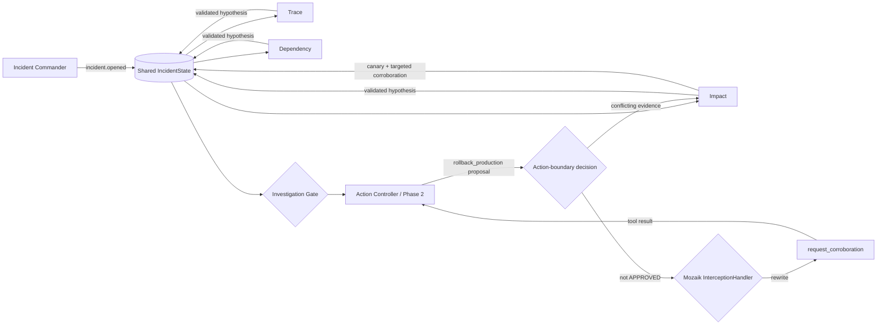

# Implementation and verification reference

Return to the [IncidentMesh README](../README.md).

## Judge verification

The important claims are directly inspectable:

| Claim | Where the repository proves it |
| --- | --- |
| Three separate responders actually overlap | `runIncidentScenario()` emits independent responder spans; the demo prints all three; tests require `overlapCount(report) === 3` |
| Peer observations happen while work is active | `awareness.peer-observed` events are emitted on peer hypotheses while responder spans are active |
| Hypotheses enter shared typed state | `IncidentState.hypotheses: Hypothesis[]`; gate handlers accept one authoritative hypothesis per registered role |
| Role claims are bound to producer identity | `registerResponder()` binds each role to its Mozaik participant ID; spoofed or unknown-role evidence is rejected |
| Invalid confidence cannot improve safety posture | evidence requires a finite numeric confidence in `[0,1]`; malformed evidence is rejected and the required role remains unavailable/degraded |
| Duplicate role evidence cannot double-count | first authoritative hypothesis for each role wins for the phase |
| Waiting and action safety are distinct | incomplete investigation evidence remains `PENDING`; the same state becomes `BLOCKED — incomplete-required-evidence` when rollback reaches the action boundary |
| The action-boundary decision is immutable | `ActionBoundarySnapshot` freezes available/missing roles, confidence, contradictions, decision, reason, and proposed action before execution |
| Late evidence remains visible without rewriting history | later hypotheses update the investigation state but do not mutate the frozen boundary snapshot |
| Rollback is intercepted end to end | both conflict and incomplete-evidence paths traverse Mozaik interception and execute `request_corroboration`; tests assert rollback itself does not execute |
| Model-mode interception is structurally reachable | a separate post-aggregation Action Controller `runLoop` receives shared evidence and traverses the same interceptor in scripted integration tests |


## Why concurrency is the point

Telemetry, dependency health, and customer impact are independent evidence streams. Serializing them delays when shared state becomes complete enough to distinguish a concrete conflict from simple missing evidence.

IncidentMesh is not one agent executing three prompts in sequence:

- Trace, Dependency, and Impact are separate Mozaik participants with independent handlers and lifecycles.
- One `incident.opened` semantic event wakes all three in the concurrent fixture.
- Peer hypothesis events fan out through runtime handlers while responder work is still in flight; this is runtime awareness, not a claim that Phase-1 LLMs receive peer hypotheses.
- The Safety Gate computes an evolving investigation state from shared evidence.
- A separate action-boundary evaluation freezes the safety decision for the proposed action; later evidence cannot rewrite that record.
- In the canonical zero-key demo, complete conflicting evidence selects the deterministic canary-and-targeted-corroboration path.
- In model mode, aggregate evidence opens a separate Phase-2 Action Controller loop whose prompt contains accepted shared hypotheses and gate state.


## How it works



The implementation uses Mozaik 4.0.5 directly:

| Mozaik primitive | IncidentMesh use |
| --- | --- |
| `defineRuntime<IncidentState>()` | one shared runtime with typed incident state |
| `createAgent` / `createHuman` | three responders, Action Controller, gate, observer, commander |
| `SemanticEvent.create` / `sendEvent` | incident, hypothesis, gate, degradation, adaptation, and evidence fan-out |
| `SituationSpecification` | event-driven participant reactions |
| `runLoop` | provider-backed Phase-1 responder turns plus post-aggregation Phase-2 mitigation |
| `InterceptionHandler` | inspect rollback function-call transitions at the action boundary |
| structured output | request provider-reported claim, confidence, and root-cause fields before validation |

### Safety Gate and action phase

The gate counts disagreement as the number of distinct authoritative root-cause hypotheses minus one. Before an action is attempted, missing required evidence is an evolving investigation state: `PENDING — pending-required-evidence`. At a production action boundary, absence of required evidence is not treated as safety. The action evaluation becomes `BLOCKED — incomplete-required-evidence`. Complete evidence with disagreement becomes `BLOCKED — conflicting-evidence`; complete evidence with one shared root-cause slug may become `APPROVED — sufficient-consistent-evidence` only when every required responder reports confidence of at least `0.8`. Root-cause agreement is a structured-field equality check, not a semantic entailment claim over free-form prose.

The frozen `ActionBoundarySnapshot` records when the boundary was reached, the evolving investigation state seen then, authoritative roles available, missing required roles, degraded roles, confidence, contradictions, the action decision/reason, and the proposed rollback. The report separately records the interception result and executed tool. Late evidence may change the final investigation state and make a more specific safe plan available, but it does not mutate the historical boundary snapshot.

`SafetyGateInterception` targets every `rollback_production` transition and fails closed: the handler atomically captures or reuses the immutable action-boundary snapshot, and only a snapshot whose decision is `approved` lets the proposal pass. Mutable investigation gate state is not an authorization fallback. In the canonical zero-key demo, the pending rollback reaches Mozaik's function-call transition after complete conflicting evidence is known, is rewritten to the registered proposal-only `request_corroboration` tool, and that safe tool executes through the normal function-call state. IncidentMesh never performs a real production rollback.

Model mode uses a genuine second phase instead of expecting a terminal investigation turn to act later. Phase-1 model hypotheses are validated before entering shared state. After aggregate evidence produces a gate result, a dedicated Action Controller `runLoop` receives the accepted shared hypotheses and current gate state. If that model emits `rollback_production`, the same `SafetyGateInterception` is on the live transition. If rewritten to `request_corroboration`, the tool result returns to the Action Controller and its later `model.answer` is recorded as the model recommendation. Scripted `InferenceRunner` tests prove this lifecycle is structurally reachable without claiming a real-provider execution.


## Measured overlap

`npm run benchmark` reports one supporting concurrency metric:

```text
latency/overlap proxy
= sum of measured responder durations / concurrent wall time
≈ 2.3× in the deterministic fixture
```

A representative run measures about 219–220 ms of concurrent wall time and about 505–508 ms when the three measured responder durations are summed. All three responder pairs overlap.

This ratio is only an overlap/latency proxy. It does **not** establish 2.3× better reasoning, throughput, MTTR, or production performance. It is deliberately secondary to the causal demonstration that disagreement changes the allowed action.


## Deterministic and provider-backed modes

The provider-free path is the canonical judging demo because it is fast and reproducible. Its evidence values and controlled delays are scripted; it does **not** connect to live observability systems.

The optional model path replaces scripted Phase-1 hypotheses with structured model output and then uses a separate Phase-2 Action Controller:

```bash
OPENAI_API_KEY=... RUN_MODEL=1 npm run dev
```

Phase-1 peer events are observed by runtime handlers, but peer hypotheses are not injected into the other Phase-1 responder models and do not trigger extra inference. Phase-1 responder agents and their inference requests receive no mitigation tools; production-action tools exist only on the Phase-2 Action Controller. Accepted model evidence must have a known role bound to the registered producer identity, a finite confidence in `[0,1]`, and non-empty claim/root-cause fields. Unknown roles, spoofed role claims, duplicates, and malformed evidence are excluded from safety calculations.

A required model responder that does not produce valid evidence before the scenario evidence deadline is explicitly degraded and closed for that action phase. Missing-at-boundary evidence may still arrive later, but once a responder is degraded at the phase deadline its delayed output is observational only and cannot re-enter authoritative gate state for that phase. In either case a rollback boundary without complete required evidence fails closed.

The repository has scripted model-mode integration tests for the two-phase lifecycle and for a generally hanging required responder. Those tests use Mozaik's agent loop, interception manager, rewritten function transition, tool execution, and follow-up `model.answer`; they are not authenticated provider evidence. No successful real-provider run is claimed unless sanitized evidence is captured and committed separately.

Provider evidence capture is safe-by-default: `npm run provider:evidence:check` only inspects model/provider selection and credential-variable availability. `npm run provider:evidence:capture` explicitly opts into one bounded provider execution and refuses to write evidence if the child process fails, the outer capture deadline fires, or the IncidentMesh report contains `incident.scenario.timeout`. Before repository copy, staged JSON/Markdown are scanned for common credential/private-path patterns; JSON receipts also must contain accepted hypotheses plus one completed inference lifecycle for each required responder with positive three-way overlap. The committed [Gemini Phase-1 receipt](evidence/real-provider-run.md) proves one bounded authenticated responder run with three overlapping inference windows; the derived [peer-awareness receipt](evidence/peer-awareness.md) makes the runtime event overlap explicit. These artifacts intentionally do not claim a full provider-backed Phase-2 tool-call execution.

The CLI checks the selected model's provider credential before starting model loops. With the default `gpt-5.5`, a missing `OPENAI_API_KEY` exits with an explicit error and emits no IncidentReport. For inference failures after startup, Mozaik 4.0.5 exposes `runLoop(): void`, so the CLI uses a process-level `unhandledRejection` boundary to terminate nonzero rather than misreport success; library-level Promise recovery is not available through the current API.

External telemetry adapters, paging integrations, and automatic production actions are outside this prototype. The concurrency and safety-control architecture is the part under test.

## Fail-closed degradation

`npm run degradation` simulates an explicit Dependency timeout before it publishes valid evidence. Trace and Impact continue. Dependency becomes explicitly degraded, the action-boundary snapshot records `BLOCKED — incomplete-required-evidence`, and Mozaik rewrites `rollback_production` to `request_corroboration`. The deterministic degraded path holds the broad rollback and records surviving Trace corroboration rather than pretending the missing Dependency signal is safe.

The model-integration tests add a more general case: a required Dependency inference runner never returns. When the evidence deadline passes, Dependency is marked degraded for the phase, its responder span is closed as unavailable, and the Action Controller still reaches the same fail-closed interception path. This is bounded phase-deadline handling; IncidentMesh does not claim arbitrary process recovery or distributed fault tolerance.

## Development

```bash
npm run typecheck
npm test
npm run build
npm run verify:built
```

Nineteen focused invariant tests cover concurrent overlap, snapshot-authoritative rollback, complete approval, complete conflict blocking, incomplete boundary blocking, per-responder confidence, causal scheduling differences, immutable boundary snapshots, closed degraded responders, generic hanging and explicit timeout degradation, producer-role binding, duplicate policy, investigation-only Phase 1, canonical Mozaik interception, provider preflight, phase-1 settling, the approved proposal-only path, and two-phase scripted model interception.

`dist/` is intentionally committed. Judges can inspect or run the built JavaScript without trusting an unpublished package, while `src/` remains the source of truth.
